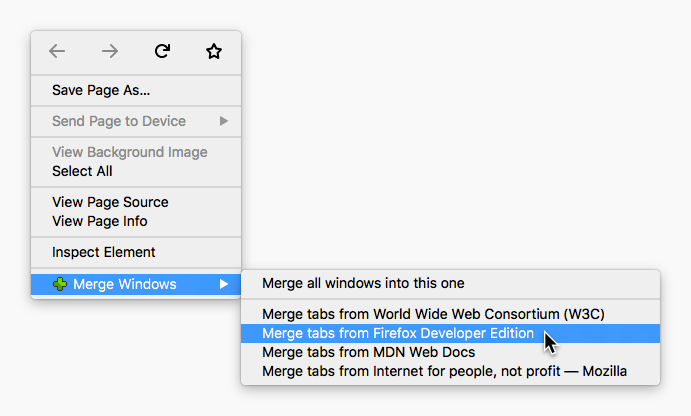
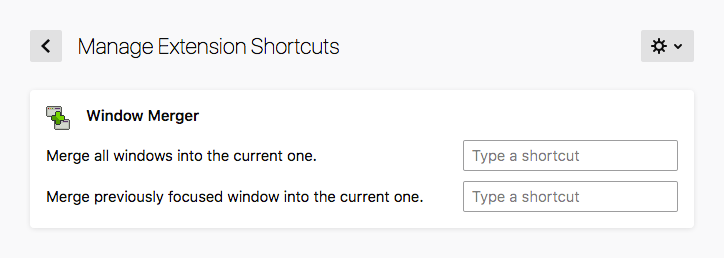

#  Window Merger

A Firefox extension for merging windows.

1. Adds a context menu to quickly merge different windows into eachother.

2. Adds the ability to set keyboard shortcuts for merging windows
   into eachother.

## Screenshots





## Code Style

This extension follows the [JavaScript Standard Style][]. I apologise if you
love semicolons. Make sure to run it under the WebExtensions environment:

```
standard --env webextensions
```

For further checking the validity of the codebase, make sure to have it linted
as a browser extension as well:

```
web-ext lint
```

## Licenses

* Everything is released under the BSD Zero Clause License (0BSD). Please see
  the [`LICENSE`](LICENSE) file for more information.

[JavaScript Standard Style]: https://standardjs.com/
