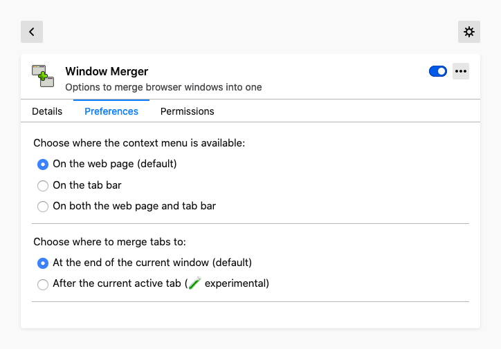
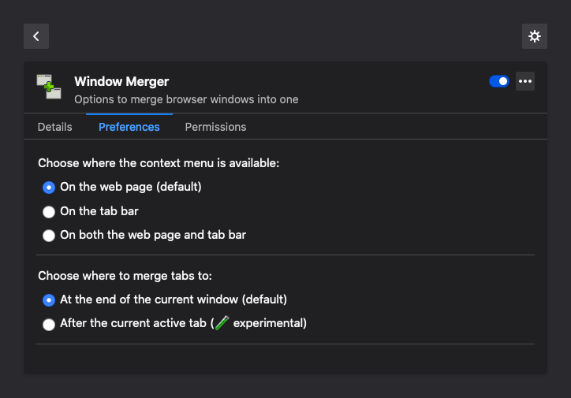

#  Window Merger

Window Merger was created to address how people want to merge browser windows
together after a long browsing session. It focusses on just that, but gives
some usability choices that other alternatives do not have.

* **Window Merger does not require you to merge everything.** Often people
  wanted to merge only specific windows together, so that choice had to
  be given.
* **Window Merger does not require you to use a mouse.** It offers configurable
  keyboard actions for those who prefer it.
* **Window Merger works together with Private Windows.** Private windows are
  kept separate from normal windows in all features. A private window will only
  ever merge with another private window, making sure tabs do not leak into
  non-private space.

Have a look at the screenshots to see what is on offer!

Special care was taken to make sure the extension would fit well within the
browser. Its preferences screen integrates with the Extensions page really
well, and adheres to dark mode if chosen by the user. Releases are also tested
with ESR versions of Firefox to be as accessible as possible.

Beside this Window Merger tries to stick to the Linux mantra of “Do One Thing
and Do It Well”.

Some other tab management extensions you may like:

* **[FoxyTab][]** — for the all in one thing. If Window Merger does not satisfy
  your habits, chances are a configuration of FoxyTab exists that does!
* **[Duplicate Tabs Closer][]** — for cleaning tabs after merging windows. If
  getting rid only of windows is not enough, Duplicate Tabs Closer can help you
  to clear out tabs as well!

## Screenshots

Context menu allowing the choice of exactly what window to merge with.


Extension shortcuts for those who want quicker access away from their mouse.


Extension preferences for making the context menu available on different parts
of the browser window, and switching the merging strategy.



The same preferences tab as it shows up in Firefox’s default theme on macOS
with the operating system appearance set to “Dark”.



## Code Style

This extension follows the [JavaScript Standard Style][]. I apologise if you
love semicolons. Make sure to run it under the WebExtensions environment:

```
standard --env webextensions
```

For further checking the validity of the codebase, make sure to have it linted
as a browser extension as well:

```
web-ext lint
```

## Licenses

* Everything is released under the BSD Zero Clause License (0BSD). Please see
  the [`LICENSE`](LICENSE) file for more information.

[FoxyTab]: https://addons.mozilla.org/firefox/addon/foxytab/
[Duplicate Tabs Closer]: https://github.com/Peuj/duplicate-tabs-closer
[JavaScript Standard Style]: https://standardjs.com/
